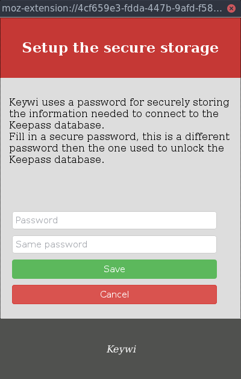
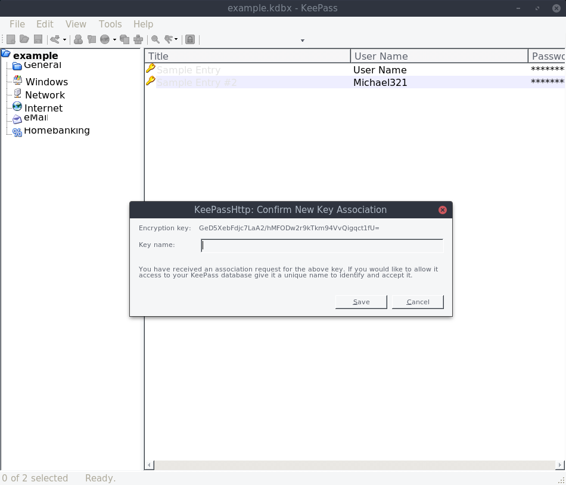
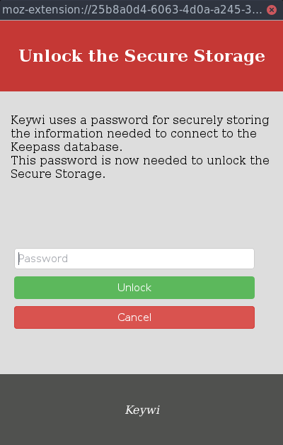
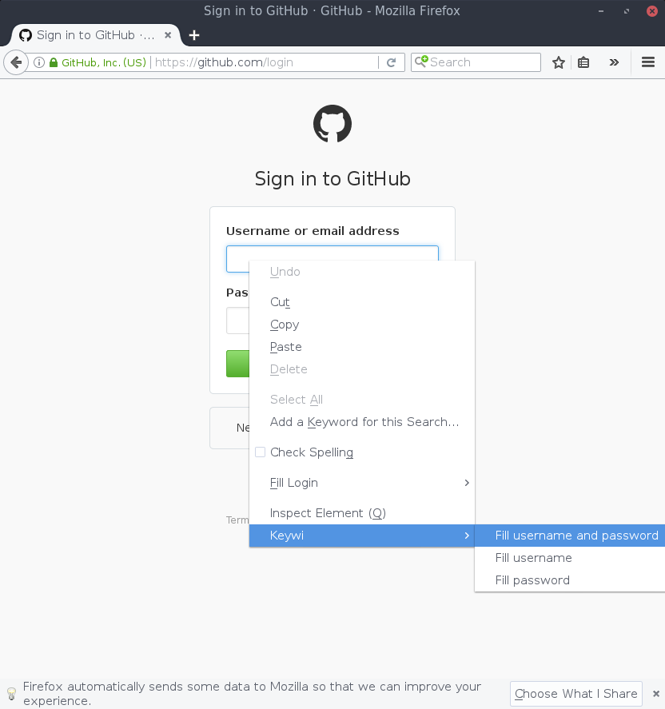

Keywi
===

Minimalistic Keepass plugin using Web Extensions and KeepassHTTP.

## Goals
 - Minimalistic password integration in Firefox
 - Fill username and password in login form, using context menu and keyboard shortcut
 - Use [Keepass HTTP](https://github.com/pfn/keepasshttp)
 - No editing of the Keepass database
 - Using the Firefox web extensions API, to support Electrolysis
 - Support Keepass, later maybe [Pass](https://www.passwordstore.org/)
 - Minimal amount of libraries (aes, cryptoheplers and reqwest)
 - no automatic form filling, i.e. only when the user wants to. This is very important because:
   - credentials can be filled in the wrong site (e.g. a DNS spoofing)
   - crendetials can be filled in the sign up form
   - credentials can be filled in a hidden form
   - you don't want to log in on this website now
   - there are multiple forms on the website (unlikely)
 - no injecting of buttons or icons into forms

## Usage
Keywi uses the local storage mechanism of the browser to store some information needed to connect to Keepass. This information includes the key used to authenticate and encrypt the communication with Keepass. The information stored in the local storage of the browser is stored unencrypted.
Therefore Keywi encrypts this information (`database.key`, `database.id` and `database.hash`) using 256-bit AES key derived from a user-provided password. 

This password is asked to the user the first time Keywi is used for encrypting the information. Every time you start Firefox it's asked to decrypt the information.

Keywi requires Firefox 51 or later.

### First time
 1. Install the KeepassHTTP plugin in Keepass. See: https://github.com/pfn/keepasshttp
 2. make sure the correct Keepass database is open
 3. install the addon
 4. you'll be asked to enter a password for secure storage. You should **not** use the same password as used in Keepass. Make sure it's a secure and strong password.

 5. keepass will ask to confirm the association

### When Firefox starts
You will be asked to unlock the Secure Storage using the same password as during the setup.

### Fill in credentials
 1. select the username input field
 2. right click and choose "Fill username and password" inside the "Keywi" submenu. It's possible to only fill your username or password.

 3. Click "Allow" when keepass asks permission for the request to the credentials
 4. the username and password are filled
 
### Keyboard shortcuts:
The following shortcuts are supported:
 - <kbd>Ctrl</kbd> + <kbd>Shift</kbd> + <kbd>F</kbd> Fill username and password in the current active input field (only the username will be filled when no password field is found)
 - <kbd>Ctrl</kbd> + <kbd>Shift</kbd> + <kbd>D</kbd> Fill only password in the current active input field
 
### Multiple Credentials for one URL
When Keepass finds multiple Credentials for one URL, it will ask you to select one:

### Disable "Remember for logins" in Firefox
To provide a better user experience we advise to disable the feature in Firefox to remember logins.  
 

## Alternatives
### [Passifox](https://github.com/pfn/passifox)
Special thanks to passifox, we used it as inspiration for this addon and use KeepassHTTP of the same author.
Some differences between this addon and Passifox:
 - some forms can't be filled (e.g. openmediavault has some problems with it)
 - doesn't uses web extensions, thus not compatible with Electrolysis
 - automatic form filling
 

 
### [Keefox](http://keefox.org/)
Some differences between this addon and Keefox:
 - doesn't uses web extensions, thus not compatible with Electrolysis
 - very feature rich, almost a password manager on it's own
 - automatic form filling

## Note about add-on ID's
To speed up the testing of the add-on we release a signed but self-distributed version of it, this addon has the id `keywi-ff-add-on-ss@ledfan.be`. The add-on distributed using AMO has `keywi-ff-add-on@ledfan.be` as id.

Warning: this means that when you switch between the self-distributed version and the version from AMO you need to re-setup the Secure Storage and re-associate with Keepass.

## Authors
 - @LEDfan Tobia De Koninck
 - @RobinJadoul Robin Jadoul
 
## License
Keywi is free software: you can redistribute it and/or modify
it under the terms of the GNU General Public License as published by
the Free Software Foundation, either version 3 of the License, or
(at your option) any later version.

Keywi is distributed in the hope that it will be useful,
but WITHOUT ANY WARRANTY; without even the implied warranty of
MERCHANTABILITY or FITNESS FOR A PARTICULAR PURPOSE.  See the
GNU General Public License for more details.

You should have received a copy of the GNU General Public License
along with Keywi.  If not, see <http://www.gnu.org/licenses/>.
 
 
## Used libraries
This project uses the following libraries which are all found under the `vendor` directory:
 - `aes.js` from slowAES https://code.google.com/archive/p/slowaes licensed under Apache License 2.0
 - `cryptoHelpers.js` from slowAES https://code.google.com/archive/p/slowaes licensed under Apache License 2.0
 - `debounce.js` part of Underscoe.js http://underscorejs.org/ licensed under the MIT license
 - `reqwest.min.js` from reqwest https://github.com/ded/reqwest licensed under the MIT license
 - `utf8.js` part of the passifox project https://github.com/pfn/passifox/blob/master/chromeipass/background/utf8.js licensed under GPL v3
 - Please note that some functions of the `background/keepass.js` file are based on functions of the passifox project https://github.com/pfn/passifox licensed under the GPL v3

## Logo
The logo is based on https://pixabay.com/en/key-lock-web-1294351/ and https://pixabay.com/en/kiwi-fruit-food-half-green-fresh-310189/
